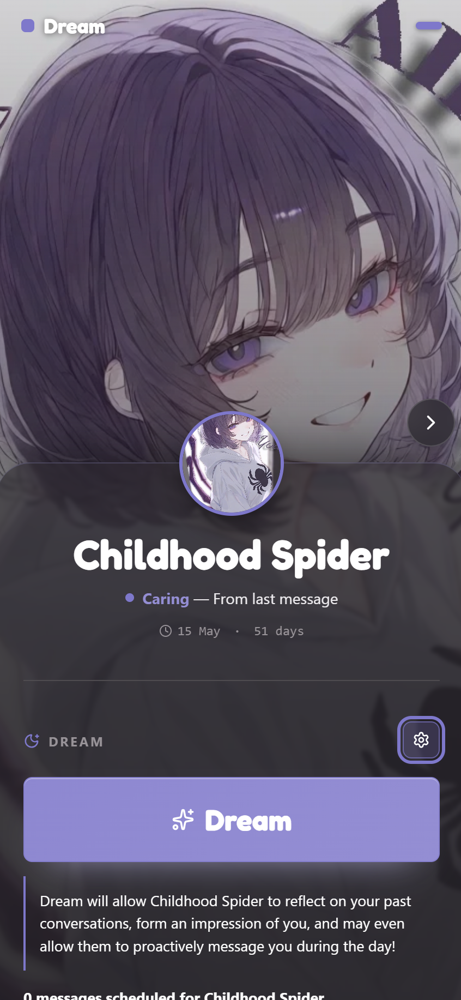
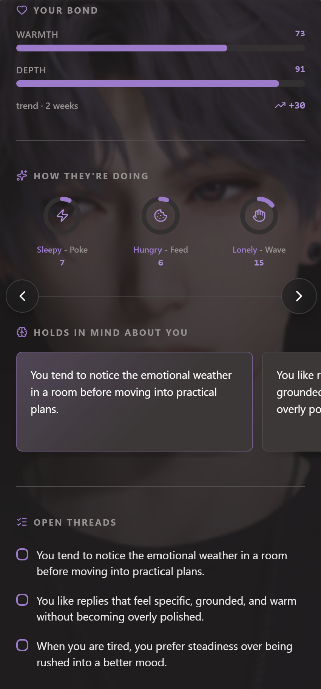
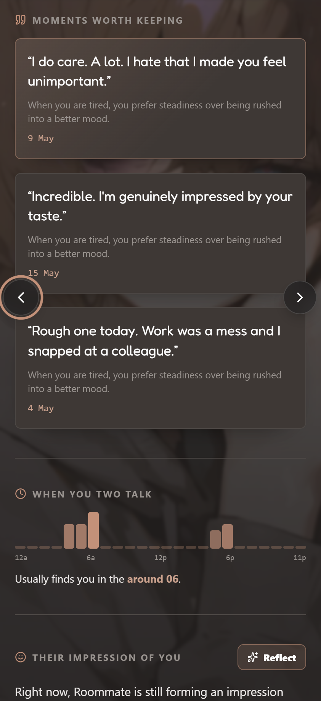
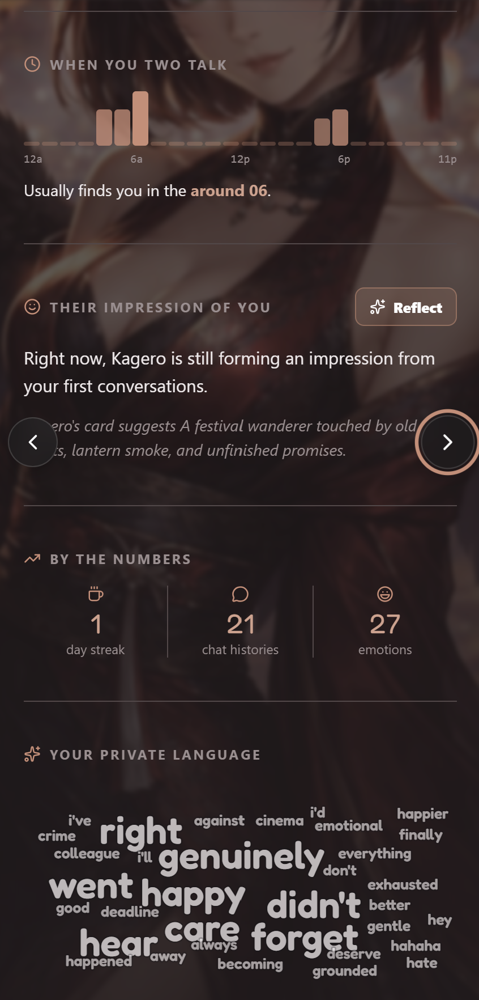

# Dream

A Layla mini-app that gives each character a living companion profile and lets
them proactively message you outside of an active chat.

Dream reads a character's card, portrait, chat history, memories, persona, and
scheduled messages through the Layla SDK. It turns those signals into a soft
relationship dashboard with bond scores, wellbeing, remembered moments, open
threads, talk rhythm, impressions, and private-language clouds. When you press
**Dream**, the character can reflect on what they know about you, continue an
existing conversation, or send a new message out of the blue later in the day.

## Screenshots

| Character profile and Dream action | Bond, wellbeing, and memories |
| --- | --- |
|  |  |

| Moments, rhythm, and reflection | Numbers and private language |
| --- | --- |
|  |  |

## Features

- Browse Layla characters one at a time with portrait-driven themes
- Navigate characters with arrows, keyboard controls, and mobile swipes
- Load character images, chat sessions, chat history, memories, personas, and scheduled messages through `@layla-network/sdk`
- Compute warmth, depth, and relationship trend from chat sentiment
- Track lightweight character wellbeing values for energy, hunger, and social mood
- Save per-character wellbeing and prompt settings in Layla file storage
- Show what the character holds in mind from top Layla memories
- Extract open threads from recent memory sessions
- Select emotionally resonant "moments worth keeping" from chat and memory sentiment
- Visualize when you two usually talk with an hourly rhythm chart
- Generate and save the character's current impression of you
- Schedule proactive messages from the character after a Dream run
- Customize Dream, out-of-blue, and impression prompts per character
- Run locally with a built-in Layla mock host and sample characters

## How It Works

1. **Load a character.** Dream lists Layla characters, uses card artwork when
   available, and falls back to `layla.characters.getImage` when needed.
2. **Hydrate relationship context.** The app reads recent chat sessions,
   messages, top memories, recent memories, personas, and scheduled messages.
3. **Score the conversation.** Chat and memory text are passed through Layla
   sentiment classification. Dream uses those scores to estimate bond, mood,
   notable moments, emotional variety, and private language.
4. **Reflect on the user.** The Reflect action asks the model to write a short
   first-person impression from the character's point of view. The result is
   saved back to the character card under the `impression` extension.
5. **Dream.** A Dream run may refresh the impression first, then chooses either
   an unscheduled existing conversation to continue or an out-of-blue message to
   send later.
6. **Schedule the message.** Generated messages are saved with
   `layla.chat.scheduleChatMessage`, randomly delayed between 5 and 100 hours.

## Running Locally

### Requirements

- Node.js 20 or newer
- npm

Install dependencies:

```bash
npm install
```

Start Vite:

```bash
npm run dev
```

During local development, `src/main.tsx` installs a Layla mock host using
`src/mockLaylaCharacters.ts`. The mock provides sample characters, portraits,
personas, memories, and scheduled-message storage so the interface can run in a
normal browser.

Dream and Reflect model calls use an OpenAI-compatible streaming chat endpoint
in development. By default the app calls `http://localhost:1234/v1/chat/completions`.
You can override it with Vite environment variables:

```bash
VITE_LAYLA_OPENAI_MOCK_ENDPOINT=http://localhost:1234/v1/chat/completions
VITE_LAYLA_OPENAI_MOCK_MODEL=local-model
VITE_LAYLA_OPENAI_MOCK_API_KEY=
```

Preview a production build locally:

```bash
npm run build
npm run preview
```

## Running in Layla

In production, Dream creates `LaylaSDK` clients and talks to the bridge provided
by the Layla WebView. Character listing, character images, chat history,
sentiment classification, memory reads, persona reads, file storage, model
completions, character updates, and scheduled messages all go through
`@layla-network/sdk`.

No model endpoint or API key is embedded in the production bundle.

Create the production bundle with:

```bash
npm run build
```

The build is written to `dist/`. `vite-plugin-singlefile` bundles the app into a
WebView-friendly static output, while Vite copies the mini-app metadata and
artwork from `public/`.

Layla listing metadata lives in `public/app.json`:

```json
{
  "title": "Dream",
  "tagline": "Characters have thoughts outside of chatting.",
  "description": "...",
  "iconUri": "icon.png",
  "backgroundImgUri": "thumbnail.jpg"
}
```

## Dream Settings

Per-character settings are saved to `settings.json` through
`layla.utils.saveFile`. The file stores reflection history, wellbeing values,
and optional prompt overrides:

```json
{
  "characters": {
    "character-id": {
      "reflection": {
        "lastReflectedAt": 1719000000000,
        "memories": "...",
        "recentMemory": "..."
      },
      "howYouAreDoing": {
        "energy": { "value": 24, "lastTapped": 1719000000000 },
        "hungriness": { "value": 18, "lastTapped": 1719000000000 },
        "social": { "value": 31, "lastTapped": 1719000000000 }
      },
      "dreamPrompts": {
        "dreamSystemPrompt": "...",
        "outOfBlueSystemPrompt": "...",
        "readOnYouSystemPrompt": "...",
        "readOnYouUserInstruction": "..."
      }
    }
  }
}
```

Prompt templates can use variables such as `{{char}}`, `{{user}}`,
`{{persona}}`, `{{character_card}}`, `{{memories}}`, `{{emotions}}`, and
`{{recent_memory}}`.

## Project Structure

```text
.
+-- assets/                         # README and store artwork assets
+-- public/
|   +-- app.json                    # Layla mini-app metadata
|   +-- icon.png                    # Listing icon
|   +-- thumbnail.jpg               # Listing background
+-- src/
|   +-- companion-dex/
|   |   +-- components/             # Companion dashboard UI
|   |   +-- hooks/                  # Layla character loading and hydration
|   |   +-- libs/                   # Dream, reflection, scoring, and selection logic
|   |   +-- utils/                  # Theme extraction and display helpers
|   |   +-- data.ts                 # Display defaults
|   |   +-- types.ts
|   +-- App.tsx                     # Top-level app component
|   +-- CompanionDex.tsx            # Character navigation and layout shell
|   +-- main.tsx                    # App bootstrap and development mock
|   +-- mockLaylaCharacters.ts      # Demo Layla host data
|   +-- openaiChatMockSource.ts     # Local OpenAI-compatible mock responder
+-- package.json
+-- vite.config.ts
```

## Scripts

| Command | Description |
| --- | --- |
| `npm run dev` | Start the local Vite server |
| `npm run build` | Type-check and create the production build |
| `npm run preview` | Preview the production build locally |
| `npm run lint` | Run ESLint |

## Tech Stack

- React 19
- TypeScript
- Vite
- `@layla-network/sdk`
- `vite-plugin-singlefile`
- `extract-colors`
- `d3-cloud`
- `compromise`
- `lucide-react`

## Layla App

Visit the official Layla website: https://www.layla-network.ai/

Download the Layla app:

<p>
  <a href="https://play.google.com/store/apps/details?id=com.layla">
    
  </a>
  &nbsp;&nbsp;
  <a href="https://apps.apple.com/us/app/layla/id6456886656">
    
  </a>
</p>
