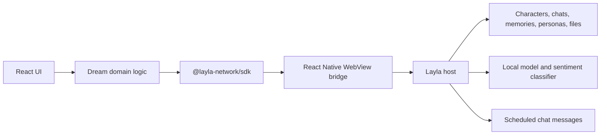
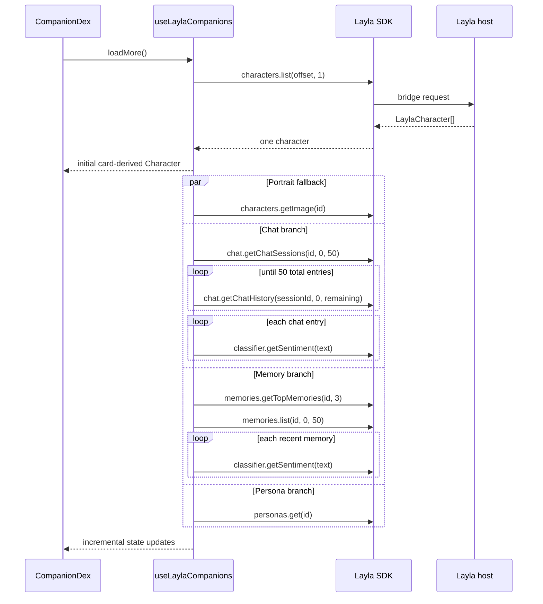
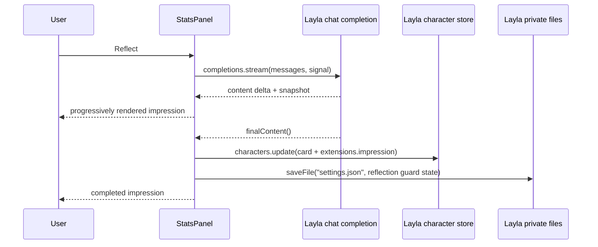

# Dream: Technical Deep Dive

Dream is a React mini-app for Layla. It turns a Layla character and the user's
history with that character into a living relationship dashboard, then uses the
same context to generate an impression of the user and schedule a future message
from the character.

This guide follows the code as it exists today. It explains which data comes from
Layla, which values Dream derives locally, where generated text is stored, and
how the browser development environment emulates the native Layla host.

## 1. The shortest useful mental model

Dream is not a separate chat service. In production it is a static web app inside
Layla's React Native WebView. `@layla-network/sdk` is its boundary to the native
host:



The SDK is not an HTTP client. There is no production API key, base URL, or
model server configured by this project. SDK methods serialize requests onto
the WebView bridge and resolve when the Layla host sends response events back.

Dream has four broad responsibilities:

1. Read characters and their relationship context from Layla.
2. Turn that context into UI-friendly state and deterministic metrics.
3. Ask Layla's model for an impression or a future in-character message.
4. Persist the result through the character, file, and scheduler SDK resources.

## 2. Repository map

The application is deliberately small at the entry point and puts most behavior
under `src/companion-dex`:

```text
src/
├── main.tsx                         browser/WebView bootstrap
├── App.tsx                          renders CompanionDex
├── CompanionDex.tsx                 character paging and visual shell
├── mockLaylaCharacters.ts           local character/memory/persona fixtures
├── openaiChatMockSource.ts          local OpenAI-compatible stream adapter
└── companion-dex/
    ├── hooks/useLaylaCompanions.ts  primary SDK hydration pipeline
    ├── types.ts                     enriched Character UI model
    ├── data.ts                      fallback display profile
    ├── libs/
    │   ├── computeBond.ts           warmth/depth/trend algorithm
    │   ├── selectMomentsWorthKeeping.ts
    │   ├── readOnYou.ts             reflection prompt construction
    │   ├── reflect.ts               streamed reflection workflow
    │   └── dream.ts                 message selection/generation/scheduling
    ├── components/StatsPanel.tsx    feature orchestration and settings state
    ├── components/stats-panel/
    │   ├── settings.ts              Layla file persistence
    │   ├── metrics.ts               local chat-derived metrics
    │   └── sections/                dashboard sections
    └── utils/themeFromImage.ts       portrait-driven color extraction
```

Useful starting points are [main.tsx](../src/main.tsx),
[useLaylaCompanions.ts](../src/companion-dex/hooks/useLaylaCompanions.ts),
[StatsPanel.tsx](../src/companion-dex/components/StatsPanel.tsx), and
[dream.ts](../src/companion-dex/libs/dream.ts).

## 3. Boot and runtime selection

### Production inside Layla

[main.tsx](../src/main.tsx) mounts React normally. Because
`import.meta.env.DEV` is false in a production build, it does not install a
mock. Every `new LaylaSDK()` instance therefore talks to the bridge injected by
Layla's WebView.

If the bridge is missing, SDK calls reject with
`LaylaBridgeUnavailableError`. The app turns that into feature-specific copy
such as “Open this mini-app inside Layla to load characters.”

### Local browser development

In development, `main.tsx` calls `installLaylaMock(...)` before React mounts and
before any SDK request can run. The mock is seeded with:

- Tavern Card V2-compatible characters;
- per-character memories and personas;
- in-memory scheduled-message behavior;
- a `respond` function for chat completions;
- 100 ms of request latency.

The `respond` function comes from
[openaiChatMockSource.ts](../src/openaiChatMockSource.ts). It adapts the SDK
mock's message array to an OpenAI-compatible streaming request. Its defaults are:

```text
endpoint: http://localhost:1234/v1/chat/completions
model:    local-model
stream:   true
```

The Vite variables in `.env.example` override the endpoint, model, and optional
API key. This direct network request exists only behind the development branch.
The production bundle relies on Layla for inference.

The adapter parses Server-Sent Events, accepts content from `delta.content`,
`message.content`, or `text`, and stops on `data: [DONE]`. Because it is an async
generator, the SDK mock can expose the result through the same streaming
abstraction used by the real host.

## 4. The two character models

The SDK supplies a `LaylaCharacter`:

```ts
type LaylaCharacter = {
  id: string;
  data: TavernCardV2;
};
```

The character card is authoritative for identity and roleplay fields. Dream
reads `data.data.name`, `description`, `personality`, `scenario`, `first_mes`,
`mes_example`, `system_prompt`, `post_history_instructions`, and `extensions`.

Dream then wraps it in its own `Character` type in
[types.ts](../src/companion-dex/types.ts). This enriched model combines:

- the original `laylaCharacter`, so it can later be updated without losing card
  fields;
- portrait, persona, chat history, memories, and loading/error states;
- sentiment payloads and in-flight sentiment promises;
- derived bond, mood, timing, thread, and dashboard values;
- locally persisted wellbeing values;
- the current generated impression.

Keeping the full SDK object matters. When Dream saves an impression it performs
an immutable update of only `data.data.extensions.impression`, then passes the
complete card to `layla.characters.update(...)`. It does not reconstruct or
discard unrelated Tavern Card fields.

## 5. Character loading is progressive hydration

The central data pipeline is the `useLaylaCompanions()` hook. It deliberately
shows a usable character shell before all expensive relationship signals have
finished.



### 5.1 Pagination

`PAGE_SIZE` is `1`. The hook initially calls
`layla.characters.list(0, 1, { signal })`. Navigating beyond the last loaded
character asks for the next page. `hasMore` remains true only when the host
returned a full page.

This choice minimizes initial work because every loaded character fans out into
image, history, memory, persona, and classifier requests. Arrow keys, swipe
gestures, arrow buttons, and the dot navigation all ultimately call the same
`go(index)` function in [CompanionDex.tsx](../src/CompanionDex.tsx).

### 5.2 Immediate card projection

`toCompanion(...)` creates a renderable object immediately. It prefers the image
stored in `extensions.image`, extracts identity text from the card, and fills
sections with card-derived placeholders while host hydration runs. The single
fallback display profile supplies the neutral dark theme and placeholder
creature state; it is not the final relationship score.

### 5.3 Portrait fallback and theming

If the card has no `extensions.image`, the hook calls
`layla.characters.getImage(character.id)`. The SDK returns a ready-to-use image
source, so the app assigns it directly to `` without prepending another
data URI prefix.

Once an image is available, `extractThemeFromUrl(...)` uses `extract-colors` to
find a prominent accent and dark surface color. It derives CSS variables for the
page, panels, chips, text, glow, and borders. Failed extraction leaves the
default theme in place; a failed portrait renders an SVG creature instead.

Cross-origin portrait URLs must permit canvas/image access for extraction. A
portrait can still be displayed even if palette extraction fails.

### 5.4 Chat history

Dream first requests up to 50 sessions using
`chat.getChatSessions(characterId, 0, 50)`. The SDK returns newest sessions
first. It then requests history from each session until it has collected at most
50 entries in total.

The hook records the newest session ID for later context, normalizes timestamps
that may be seconds or milliseconds for display, and computes:

- `lastChat` from the newest session timestamp, falling back to message time;
- `daysKnown` from the earliest fetched message day;
- a 24-bin local-time histogram for the talk rhythm;
- the longest consecutive run of distinct calendar days;
- the number of fetched chat entries shown as “chat histories.”

The 50-entry cap is important: these values describe the fetched window, not
necessarily the user's entire lifetime history with a character.

### 5.5 Sentiment classification

Every non-empty fetched chat entry is sent, sequentially, to
`layla.classifier.getSentiment(text, { signal })`. The response is a
multi-label `SentimentValues` object based on GoEmotions-style labels.

Dream stores `{ text, timestamp, sentimentValue }` as `ScoredText`. That shared
shape feeds mood, bond, notable moments, and the emotion count. The first scored
chat entry also supplies the displayed `mainMood`: Dream chooses the strongest
non-neutral emotion that clears the SDK's exported `SENTIMENT_THRESHOLDS`.

Sequential classification limits concurrent pressure on an on-device host, but
it also means this is usually the longest hydration branch. The hook exposes the
promise on the character so downstream work can distinguish “still computing”
from “not available.”

### 5.6 Memories and personas

Two memory calls run together:

- `memories.getTopMemories(characterId, 3)` supplies the three cards in “Holds
  in mind about you.” The host owns the ranking heuristic.
- `memories.list(characterId, 0, 50)` supplies recent memory records for
  threads, reflection context, private language, and memory sentiment.

For display, Dream prefers `memory.summary` and falls back to `rawText`.
“Open threads” are the last sentence of the newest memory in each distinct
session, capped at three. This is a lightweight heuristic, not an LLM call.

Recent memories are also classified one at a time. Their scored summaries are
used to annotate moments selected from raw chat.

`personas.get(characterId)` supplies the user identity and description attached
to this character. Prompt builders use the persona name as `{{user}}` and the
description as grounded information about that user. Empty personas are ignored.

## 6. How each dashboard feature is calculated

The dashboard deliberately mixes host facts and deterministic local analysis.
The following table shows the boundary.

| Feature | Source | Calculation |
| --- | --- | --- |
| Character identity | Character card | Direct projection |
| Portrait | Card extension, then `characters.getImage` | Direct image source |
| Main mood | Chat + classifier | Strongest threshold-clearing non-neutral label |
| Days known / last chat | Chat sessions and entries | Timestamp arithmetic over fetched window |
| Warmth / depth / trend | Chat + classifier | Local EMA algorithm |
| Wellbeing | `settings.json` | Local decay and user taps |
| Holds in mind | `getTopMemories` | Host-ranked, top three |
| Open threads | Recent memories | Last sentence per newest distinct session |
| Moments worth keeping | Chat and memory sentiment | Local emotional ranking and time matching |
| Talk rhythm | Chat history | 24-bin local-hour histogram |
| Impression | Model completion | Saved to card extension |
| Streak / count / emotions | Chat and sentiment | Local counting |
| Private language | Chat + memories | Stopword-filtered frequency cloud |
| Future messages | Model completion + scheduler | Saved with `scheduleChatMessage` |

### 6.1 Bond: warmth, depth, and trend

[computeBond.ts](../src/companion-dex/libs/computeBond.ts) is pure and
deterministic. It sorts scored entries chronologically and starts warmth and
depth at the no-information baseline of 50.

For each entry it ignores emotion activations below the SDK's threshold, then
computes two weighted sums:

- warmth is signed. Love, caring, and gratitude pull upward; anger, disgust,
  and disapproval pull downward. Vulnerable negative emotions such as grief and
  fear remain close to neutral rather than being treated as hostility.
- depth is mostly valence-independent. Grief, love, remorse, fear, and sadness
  are strong signals; neutral has no depth weight.

Each raw sum is squashed to a 0–100 target with `tanh`, then blended with the
running value using an exponential moving average with `alpha = 0.08`:

```text
next = current + 0.08 × (target - current)
```

Depth subtracts a `0.25` neutral anchor before squashing, so low-substance text
can pull depth below 50 rather than leaving every neutral conversation at the
baseline. Trend is the rounded change in the average of warmth and depth over
the analyzed span.

### 6.2 Moments worth keeping

[selectMomentsWorthKeeping.ts](../src/companion-dex/libs/selectMomentsWorthKeeping.ts)
scores raw chat lines, not generated summaries. A candidate must contain a
“keepable” emotion such as love, caring, joy, gratitude, realization, grief, or
surprise at activation `>= 0.35`, and its net weighted emotional score must be
positive.

The ranking multiplies four terms:

```text
weighted emotion × strongest keepable activation × length preference × recency
```

The length curve prefers roughly 6–20 words. Recency has a 14-day half-life but
a floor of 0.5, so older strong moments can survive. Greedy selection returns at
most three moments, rejects exact normalized duplicates, and requires selected
quotes to be at least 24 hours apart.

For each quote, Dream attaches the most emotionally resonant memory summary
within 12 hours. If none exists in that window, it uses the closest memory in
time. This produces a raw, quotable headline with a host-produced memory summary
as context.

### 6.3 Wellbeing

Energy, fed/hungriness, and social values are Dream-owned state. On first use,
each is initialized randomly from 10 through 30 and saved per character. Values
decay continuously with a one-day half-life:

```text
current = savedValue × 0.5^(elapsedDays)
```

The UI recalculates once per minute. Poke, Feed, or Wave adds one to the decayed
current value and resets that vital's timestamp. These values also become the
`{{emotions}}` prompt value—for example `Sleepy, Hungry, Lonely` or
`Energetic, Fed, Warm`—so lightweight user interaction can influence a later
reflection or proactive message.

### 6.4 Private language

The word cloud combines fetched chat content with recent memory summaries. It
lowercases and tokenizes Unicode words, removes standard English stopwords,
generic conversation words, and both participants' names, then keeps the 34
most frequent terms.

`d3-cloud` lays them out with a seed derived from the character ID and word
frequencies. The seeded pseudo-random function makes the same dataset render in
a stable arrangement instead of jumping around on every React render.

## 7. Reflection: producing the character's impression of the user

Reflection is the only user-facing generation path that streams tokens into the
interface. Its prompt inputs are assembled in
[readOnYou.ts](../src/companion-dex/libs/readOnYou.ts):

- character name, compact description, and personality;
- character-specific user persona;
- relationship stage based on fetched message frequency;
- time since the earliest fetched chat;
- a qualitative summary of warmth and depth;
- the previous saved impression;
- selected memory summaries from moments worth keeping;
- current wellbeing-derived emotions;
- the newest open thread.

Templates use `{{name}}` placeholders. Unknown placeholders render as an empty
string. Per-character overrides can replace the reflection system prompt and
user instruction without modifying source code.

Reflection is guarded. It can run only after chat, chat sentiment, memories,
memory sentiment, and persona loading have settled; recent memories must exist;
both the memory selection and recent thread must differ from the previous run;
and more than 24 hours must have elapsed since the last reflection.



`runReflection(...)` subscribes to the stream's `content` event and awaits
`finalContent()`. It then updates `extensions.impression` through the callback
owned by `useLaylaCompanions`, which in turn calls
`layla.characters.update(fullCard)` and updates React state with the returned
character ID.

Finally it records the reflection timestamp and the exact `memories` and
`recent_memory` prompt strings in `settings.json`. The card stores the durable
content; the settings file stores the guard metadata.

Changing characters or starting another reflection aborts the prior
`ChatCompletionStream`.

## 8. Dream: choosing and scheduling a future message

The Dream action creates one scheduled message. It first fetches all scheduled
messages through `chat.getScheduledChatMessages()` and filters them locally by
character because the SDK endpoint returns a global, unpaginated list.

### 8.1 Candidate selection

Dream groups fetched chat entries by non-empty `session_id`. A session is a
candidate only when:

- it belongs to the current character's fetched history;
- it contains at least one non-empty assistant/character message; and
- no scheduled message for this character already targets that session.

It also offers one `out_of_blue` candidate when the character does not already
have a scheduled message whose `session_id` is null. A uniform random choice is
made across the available continuation sessions plus that optional new-message
candidate. Consequently, characters with many eligible sessions are more likely
to continue an old conversation than to start a new one.

If reflection is currently eligible, Dream performs it first and saves the new
impression. The scheduling step still uses the `character` object captured by
the current render, so the out-of-blue prompt for that same click may use the
previous in-memory impression; the updated card appears on the subsequent React
render. This distinction is useful when modifying the workflow.

### 8.2 Continuing a conversation

For a continuation, Dream sorts the chosen session chronologically, finds its
last assistant message, and keeps at most the six messages ending at that point.
It intentionally excludes later user messages so the generated text continues
from a point where the character last spoke.

The completion request contains:

1. a system prompt built from the full relevant character card, user persona,
   and wellbeing-derived emotions;
2. the selected recent messages mapped to OpenAI-shaped `user`/`assistant`
   roles;
3. a synthetic user message such as `[2 days have passed]`.

The elapsed duration includes both time already passed since the selected
character message and the newly chosen delivery delay. The model therefore
writes for the intended future delivery moment.

### 8.3 Starting a message out of the blue

The out-of-blue branch uses a system prompt containing character details and a
user prompt containing moments worth keeping, the current impression, and
wellbeing-derived emotions. It does not attach a session: the scheduled
message's `session_id` is `null`.

### 8.4 Generation and native scheduling

Both branches use non-streaming `chat.completions.create(...)` because no draft
is displayed. An empty response is treated as an error. Delivery is chosen
uniformly from integer delays of 5 through 100 hours, then persisted with:

```ts
await layla.chat.scheduleChatMessage({
  id: 0,
  character_id: character.id,
  session_id: existingSessionIdOrNull,
  timestamp: scheduledAt,
  message: response,
});
```

`id: 0` tells the host to create a new record. Layla assigns the actual ID and
owns future delivery. Dream merely adds the returned record to its local list so
the schedule UI updates immediately.

The same `AbortController` covers optional reflection, completion, and schedule
creation. Changing characters or starting another Dream run aborts the old flow.

## 9. Settings persistence through Layla files

[settings.ts](../src/companion-dex/components/stats-panel/settings.ts) stores all
Dream-owned durable state in the mini-app's private `settings.json`:

```json
{
  "characters": {
    "character-id": {
      "reflection": {
        "lastReflectedAt": 1719000000000,
        "memories": "- selected memory text",
        "recentMemory": "latest open thread"
      },
      "howYouAreDoing": {
        "energy": { "value": 24, "lastTapped": 1719000000000 },
        "hungriness": { "value": 18, "lastTapped": 1719000000000 },
        "social": { "value": 31, "lastTapped": 1719000000000 }
      },
      "dreamPrompts": {
        "dreamSystemPrompt": "...",
        "outOfBlueSystemPrompt": "...",
        "readOnYouSystemPrompt": "...",
        "readOnYouUserInstruction": "..."
      }
    }
  }
}
```

`utils.readFile("settings.json")` may return a data URI, so the loader strips
the prefix, base64-decodes the bytes, and uses `TextDecoder` for UTF-8. Missing,
malformed, or structurally invalid settings safely become `{}`.

Saves perform the reverse transformation and call
`utils.saveFile("settings.json", rawBase64, false)`. The `false` flag means no
native share sheet. A module-level promise queue serializes writes so rapid
wellbeing taps or prompt edits cannot race out of order at the bridge boundary.

Prompt textareas save automatically per character. Resetting stores an empty
override object, causing prompt builders to fall back to source defaults.

## 10. SDK calls used by this project

| SDK call | Where | Purpose |
| --- | --- | --- |
| `installLaylaMock` | `main.tsx` | Emulate the host in Vite development |
| `characters.list` | `useLaylaCompanions` | Page through characters |
| `characters.getImage` | `useLaylaCompanions` | Portrait fallback |
| `characters.update` | `useLaylaCompanions` | Persist `extensions.impression` |
| `chat.getChatSessions` | `useLaylaCompanions` | Discover per-character sessions |
| `chat.getChatHistory` | `useLaylaCompanions` | Hydrate transcripts |
| `classifier.getSentiment` | `useLaylaCompanions` | Score chats and memories |
| `memories.getTopMemories` | `useLaylaCompanions` | Host-ranked memory cards |
| `memories.list` | `useLaylaCompanions` | Recent relationship context |
| `personas.get` | `useLaylaCompanions` | Character-specific user identity |
| `chat.completions.stream` | `reflect.ts` | Progressive impression generation |
| `chat.completions.create` | `dream.ts` | Generate final scheduled-message text |
| `chat.getScheduledChatMessages` | `DreamSection` | Avoid duplicate scheduled targets |
| `chat.scheduleChatMessage` | `dream.ts` | Hand future delivery to Layla |
| `utils.readFile` | `settings.ts` | Load private app state |
| `utils.saveFile` | `settings.ts` | Save private app state |

The repository creates several `LaylaSDK` instances in separate modules. They
all address the same injected host bridge; there is no per-client authentication
or separate server session. A future refactor could share one instance for
clarity, but current behavior does not depend on client identity.

## 11. Cancellation, errors, and progressive UI

On-device inference and classification can be slow, so the application treats
loading as normal state rather than blocking the entire screen.

Every hydration family owns `AbortController` instances. Unmounting the hook
aborts list, portrait, history, memory, persona, and classifier requests. Feature
flows abort when the active character changes. `LaylaAbortError` is deliberately
ignored because it represents obsolete work, not a user-visible failure.

Other errors are translated at the feature boundary:

- `LaylaBridgeUnavailableError` explains that the app must run inside Layla;
- `LaylaError` preserves the host/SDK message;
- unknown failures use a feature-specific fallback.

The `Character` model contains independent loading and error fields for history,
chat sentiment, bond, memories, memory sentiment, and persona. This prevents one
failed branch from hiding a portrait or unrelated metric that loaded correctly.

## 12. Build, package, and release

The stack is React 19, TypeScript, and Vite. `npm run build` runs the TypeScript
project build and then Vite. `vite-plugin-singlefile` in
[vite.config.ts](../vite.config.ts) inlines the JavaScript and CSS into a
WebView-friendly `dist/index.html`. Vite also copies `public/app.json`,
`public/icon.png`, and `public/thumbnail.jpg` into `dist`.

The app metadata describes how Dream appears in Layla. A valid release archive
must put `index.html`, `app.json`, and referenced assets at the root—not inside
an extra parent directory.

The GitHub release workflow triggers on changes to the app/build inputs, installs
with `npm ci`, builds `dist`, zips the contents of `dist` at the archive root,
and creates a `dream-v<package-version>` release if that tag does not already
exist.

## 13. A practical extension recipe

When adding a new host-backed dashboard feature, follow the existing separation:

1. Add the required SDK value and loading/error state to `Character`.
2. Hydrate it in `useLaylaCompanions` with an abort signal.
3. Keep deterministic transformation in a pure function under `libs` or
   `components/stats-panel/metrics.ts`.
4. Render it in a focused section component.
5. If it affects prompts, add an explicit prompt value rather than reaching into
   the UI from the generation library.
6. Persist Dream-owned state with `utils.readFile/saveFile`; persist character
   identity or card semantics with `characters.update`; persist future messages
   with the chat scheduler.

For example, a “shared topics” feature could reuse recent memories and chat
history without another host request, compute normalized topic frequencies in a
pure function, and add a `{{shared_topics}}` value to the reflection and Dream
prompt builders. If it needs more than the current 50-entry window, the correct
change is explicit pagination—not assuming the existing array is complete.

## 14. Current implementation details worth remembering

- Character pagination is one item at a time, but each item triggers several
  background requests.
- Chat-derived numbers cover at most 50 fetched entries across up to 50 newest
  sessions.
- Sentiment calls are sequential per data source and can dominate load time.
- Scheduled messages are fetched globally and filtered in the browser.
- One pending schedule is allowed per existing session, plus one out-of-blue
  message per character.
- Reflection content lives on the character card; reflection guard state,
  wellbeing, and prompt overrides live in the mini-app private settings file.
- Reflection streams; Dream message generation does not.
- Production inference stays behind Layla's bridge. Only the development mock
  calls the configurable OpenAI-compatible HTTP endpoint.
- Timestamp normalization is performed in several chat/schedule display paths.
  Any new metric should normalize seconds-versus-milliseconds consistently
  before doing calendar arithmetic.

With those boundaries in mind, the project becomes straightforward to reason
about: Layla supplies identity, history, memory, model execution, persistence,
and delivery; Dream turns those capabilities into a cohesive relationship
experience.
